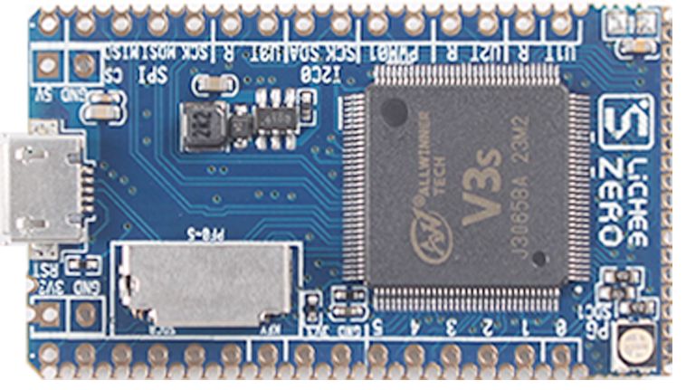
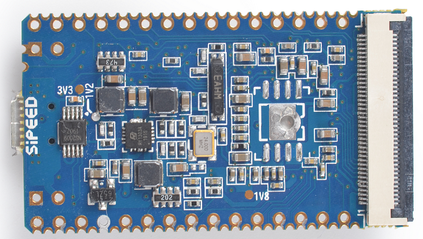
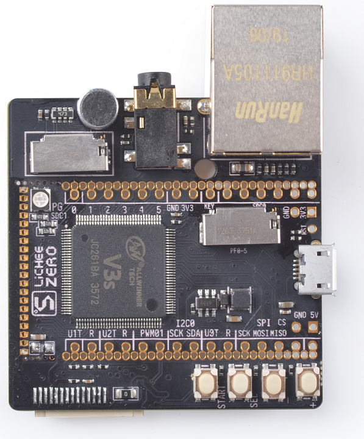
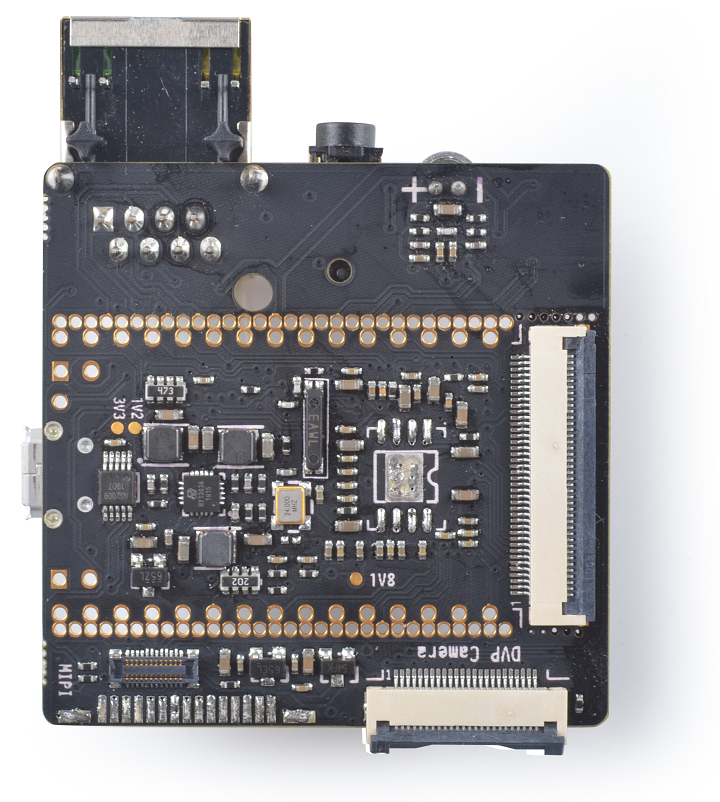
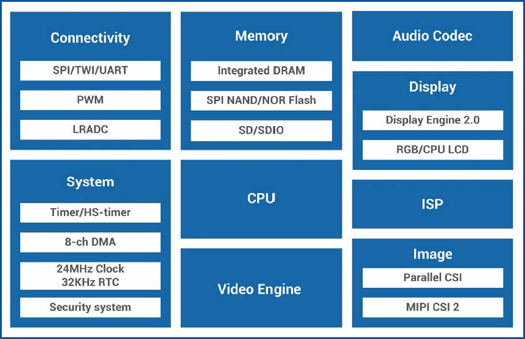
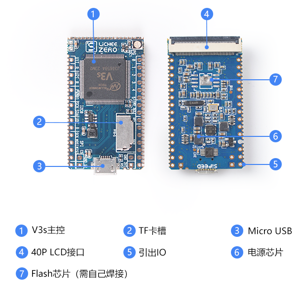
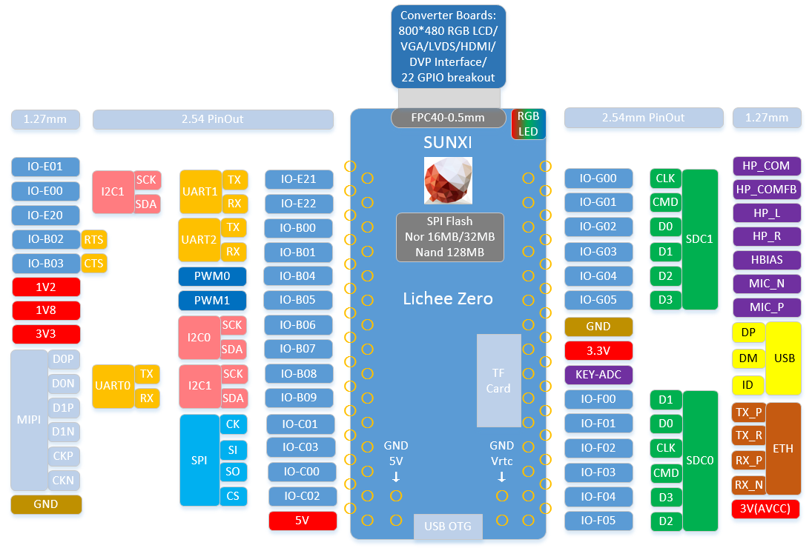
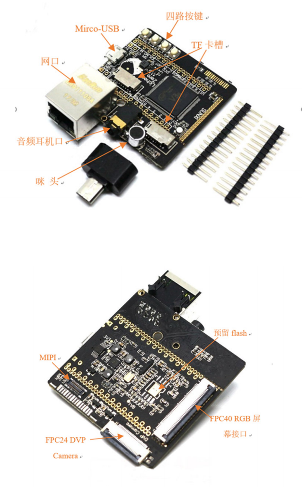

# Lichee Zero

> Nguồn: Sipeed Wiki — trang Lichee Zero, lưu offline bằng SingleFile ngày 2026-07-06.  
> Bản này đã được chuyển từ HTML sang Markdown, ảnh được tách ra thư mục `assets/`, và nội dung được dịch sang tiếng Việt.

## 1. Tổng quan Lichee Zero

Lichee Zero là một board phát triển mini dựa trên SoC hiệu năng cao **Allwinner V3s** với nhân **ARM Cortex-A7**. Board có thiết kế nhỏ gọn, đưa hầu hết tài nguyên của chip ra ngoài, tích hợp sẵn USB, Flash, khe thẻ TF/microSD, đầu nối LCD 40P và các chân IO để lập trình viên có thể mở rộng. Board phù hợp cho người mới học Linux embedded hoặc dùng trong phát triển sản phẩm thương mại.

Bo mạch lõi:

Bo mạch lõi + bo mạch mở rộng:

## 2. Thông số

### 2.1. Thông số V3s

Khối chức năng của V3s:

| Hạng mục | Thông số |
| --- | --- |
| CPU | ARM Cortex™-A7, tối đa 1.2 GHz |
| Bộ nhớ | Tích hợp 64 MB DRAM |
| Audio Codec | Tích hợp audio codec 92 dB Hỗ trợ 2 kênh ADC và 2 kênh DAC Hỗ trợ ngõ ra bias micro analog nhiễu thấp Hỗ trợ 1 ngõ vào micro và 1 ngõ ra stereo microphone |
| Video | Hỗ trợ mã hóa H.264 1080p@40fps hoặc 1080p@30fps + VGA@30fps Hỗ trợ giải mã H.264 1080p@30fps và MJPEG 1080p@30fps |
| Video Input/Output | Hỗ trợ CSI song song 8/10/12-bit và MIPI CSI2 4 lane Hỗ trợ cảm biến CMOS tối đa 5M Hỗ trợ LCD RGB/i80/LVDS, độ phân giải tối đa 1024x768 |
| Kết nối | 3 bộ điều khiển SD card LRADC / SPI / TWI / UART / PWM USB, EMAC + PHY |
| ISP | Tích hợp ISP tối đa 5M pixel Hỗ trợ 2 kênh output riêng cho hiển thị và mã hóa Hỗ trợ nhiều định dạng input/output Hỗ trợ AE / AF / AWB Hỗ trợ chỉnh saturation, khử nhiễu, sửa điểm ảnh lỗi và sửa méo ảnh |

### 2.2. Thông số bo mạch lõi Lichee Zero

| Hạng mục | Thông số |
| --- | --- |
| CPU | V3s |
| Bộ nhớ | 64 MB DDR2 |
| Lưu trữ | Chừa sẵn pad hàn SOP8 cho SPI Flash Tích hợp khe thẻ TF/microSD |
| Hiển thị | Đầu nối FPC LCD RGB 40P thông dụng Có thể cắm trực tiếp các màn hình 40P 4.3/5/7 inch thông dụng, có mạch điều khiển đèn nền onboard Có thể dùng board chuyển để cắm màn hình 50P 7/9 inch Hỗ trợ các độ phân giải thông dụng như 272x480, 480x800, 1024x600 Tích hợp chip cảm ứng điện trở, hỗ trợ màn hình cảm ứng điện trở Tích hợp LED RGB |
| Giao tiếp | SDIO x2, có thể dùng với module SDIO WiFi + BT tương ứng SPI x1 I2C x2 UART x3 Ethernet 100M x1, bao gồm EPHY USB OTG x1 MIPI CSI x1 |
| Giao tiếp khác | PWM x2 LRADC x1 Speaker x2 + Mic x1 |
| Đặc tính điện | Cấp nguồn 5V qua Micro USB Cấp nguồn 3.3V~5V qua chân cắm 2.54 mm Cấp nguồn qua lỗ tem/bán nguyệt 1.27 mm |

### 2.3. Bo mạch mở rộng Lichee Zero

| Hạng mục | Thông số |
| --- | --- |
| CPU | V3s |
| Bộ nhớ | 64 MB DDR2 |
| Lưu trữ | Chừa sẵn pad hàn SOP8 cho SPI Flash Tích hợp khe thẻ TF/microSD |
| Hiển thị | Đầu nối FPC LCD RGB 40P thông dụng Có thể cắm trực tiếp các màn hình 40P 4.3/5/7 inch thông dụng, có mạch điều khiển đèn nền onboard Có thể dùng board chuyển để cắm màn hình 50P 7/9 inch Hỗ trợ các độ phân giải thông dụng như 272x480, 480x800, 1024x600 Tích hợp chip cảm ứng điện trở, hỗ trợ màn hình cảm ứng điện trở Tích hợp LED RGB |
| Giao tiếp | SDIO x2, có thể dùng với module SDIO WiFi + BT tương ứng SPI x1 I2C x2 UART x3 Ethernet 100M x1, bao gồm EPHY USB OTG x1 MIPI CSI x1 |
| Giao tiếp khác | PWM x2 LRADC x1 Speaker x2 + Mic x1 |
| Ngoại vi onboard | Cổng Ethernet Cổng tai nghe 3.5 mm Micro electret Khe thẻ TF/microSD bổ sung 4 nút bấm Giao tiếp MIPI |
| Đặc tính điện | Cấp nguồn 5V qua Micro USB Cấp nguồn 3.3V~5V qua chân cắm 2.54 mm Cấp nguồn qua lỗ tem/bán nguyệt 1.27 mm |

## 3. Hướng dẫn sử dụng

- [Lichee Zero — tài liệu hướng dẫn trên Sipeed Wiki](https://wiki.sipeed.com/soft/Lichee/zh/Zero-Doc/Start/intro_cn.md)

## 4. Hỗ trợ kỹ thuật sản phẩm

Board phát triển Lichee Zero có thể đáp ứng nhiều nhu cầu khác nhau trong nhiều tình huống ứng dụng. Board đã được sử dụng rộng rãi trong lĩnh vực AIoT; chất lượng và hiệu năng có uy tín tốt trong ngành. Đội ngũ kỹ thuật chuyên nghiệp có thể hỗ trợ khách hàng xử lý nhiều vấn đề về thiết kế phần cứng và chức năng phần mềm.

Để được hỗ trợ kỹ thuật chuyên sâu hơn và nhận thêm tài liệu chi tiết, liên hệ bộ phận kinh doanh/hỗ trợ qua email: [support@sipeed.com](mailto:support@sipeed.com).
